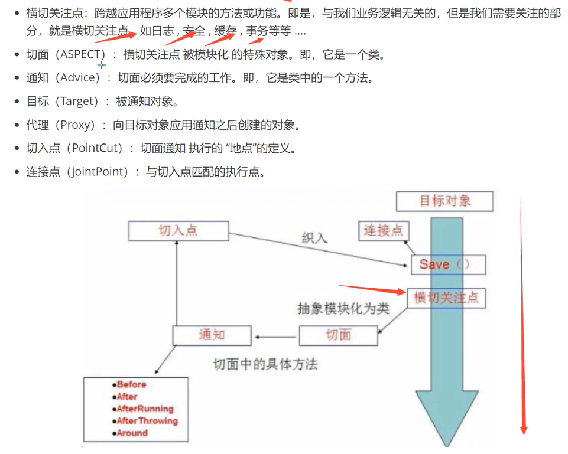

内部类：作为其外部类成员的内部类，称为成员内部类。除另有说明外，“内部类”通常是指成员内部类。
内部类并可直接访问外围类对象的方法和字段。此外，由于内部类与外部类实例相关联，因此不能在内部类中定义任何静态（static）成员。
要实例化内部类，就必须首先实例化外部类。然后，使用以下语法在外部对象中创建内部对象：
OuterClass.InnerClass innerObject = outerObject.new InnerClass();
可以用内部类来实现助手类（Helper Class）。如要处理用户界面的事件，就必须知道如何使用内部类，因为内部类广泛地使用在事件处理机制上。

SSM框架集（Spring+SpringMVC+MyBatis），SpringMVC是Spring中的部分内容
Spring就像是整个项目中装配bean的大工厂，在配置文件中可以指定使用特定的参数去调用实体类的构造方法来实例化对象。 也可以称之为项目中的粘合剂。
Spring的核心思想是IoC（控制反转），即不再需要程序员去显式地`new`一个对象，而是让Spring框架帮你来完成这一切。
SpringMVC在项目中拦截用户请求，它的核心Servlet即DispatcherServlet承担中介或是前台这样的职责，
将用户请求通过HandlerMapping去匹配Controller，Controller就是具体对应请求所执行的操作。
SpringMVC相当于SSH框架中struts。
mybatis是对jdbc的封装，它让数据库底层操作变的透明。mybatis的操作都是围绕一个sqlSessionFactory实例展开的。
mybatis通过配置文件关联到各实体类的Mapper文件，Mapper文件中配置了每个类对数据库所需进行的sql语句映射。
在每次与数据库交互时，通过sqlSessionFactory拿到一个sqlSession，再执行sql命令。

<h1 >Spring 笔记</h1>
注解开发+bean.xml配置文件实现类对象的创建
<bean id="xxx" class="xxxxxxxx"/>
每当编写并且编译了一个新类，就会产生一个class对象,在Java中每个类都有且只有一个Class对象,
为了获得class对象，可以用Class类的中静态forName()方法获得与字符串相应的Class对象。比如：
1、Class c1 = x.getClass();
2、Class c2=Class.forName("MyObject"),MyObject必须是接口或者类的名字。
    c2.newInstance():创建一个实例，只能调用默认构造器。
        A a = (A)Class.forName(“pacage.A”).newInstance();//newInstance返回的是object类型
        这和 A a = new A()； 是一样的效果。
        动态加载和创建Class 对象，比如想根据用户输入的字符串来创建对象时需要用到：
        String str = “用户输入的字符串” ;
        Class t = Class.forName(str);
        t.newInstance();//使用类加载机制创建类对象
        newInstance()实际上是把new这个方式分解为两步，即首先调用Class加载方法加载某个类，然后实例化。
        但是newInstance: 弱类型。低效率。只能调用无参构造。
    或者x.getClass.newInstance()，创建了一个同x一样类型的新实例。newInstance()方法调用默认构造器（无參数构造器）初始化新建对象。
    c2.getName():以string类型返回class对象表示的实体（类，接口，数组，基本类型，void等）名称
    c2.isInterfence:告诉你这个class对象是否表示某个接口。

例子：在载入数据库驱动时经常调用Class.forName("com.microsoft.sqlserver.jdbc.SQLServerDriver");
这里之所以不用newInstance()是因为Class.forName("");的作用是要求JVM查找并加载指定的类，如果在类中有静态初始化器的话，JVM必然会执行该类的静态代码段。
而在任何一个JDBC Driver的 Driver类的代码中都会在静态初始化器中进行注册：
public class MyJDBCDriver implements Driver {
static {//静态初始化器，在加载时，初始化类的静态域。如有多个static{}程序段，则在类的初始化时，会依次执行。
DriverManager.registerDriver(new MyJDBCDriver());
}
}//静态初始化器与构造函数相同，都是用来完成初始化的工作，
但构造函数是在用new运算符产生新对象时由系统自动执行，
而静态初始化器则是在它所属的类加载到内存时由系统调用执行。
所以我们在使用JDBC时只需要Class.forName(XXX.XXX);就可以了，这时类会被加载到内存中去。

在beanFactory类中用到了Class clazz=forName(“xml配置文件中获取到的package.类名“)
                return clazz.newInstance()的方法创建类的实例实现解耦
通过配置文件找到对应的类，通过反射来获取到该类的对象，并实现该对象，实现其方法和功能。
切换底层的实现类的时候，只需要在XML当中修改class的路径名称即可
xml 文件头部的部分：被称为命名空间，这里的东西相当于写bean中需要的依赖,例如
<beans xmlns="http://www.springframework.org/schema/beans"
xmlns:xsi="http://www.w3.org/2001/XMLSchema-instance"
xmlns:context="http://www.springframework.org/schema/context"
xmlns:p="http://www.springframework.org/schema/aop"
xmlns:c="http://www.springframework.org/schema/c"
xmlns:aop="http://www.springframework.org/schema/aop"
xsi:schemaLocation="http://www.springframework.org/schema/beans
https://www.springframework.org/schema/beans/spring-beans.xsd
http://www.springframework.org/schema/context
https://www.springframework.org/schema/context/spring-context.xsd
http://www.springframework.org/schema/aop
https://www.springframework.org/schema/aop/spring-aop.xsd ">
在配置时可以自动导入，例如<aop:config>回车可以自动导入aop的命名空间

实际上对象都交由spring容器管理 实现类相当于业务层 从spring容器取出需要的对象再用该对象完成所需要的业务返回给调用者。
@Component\@Repository\@Service\@Controller这四个注解功能一样的，都是装配在bean中。
@scope是设计模式
xml与注解，xml适用与任何场合，维护简单方便
注解维护较复杂
一般来说，xml用来管理bean，注解只负责属性的注入
使用注解注意声明：
<context:annotation-config/>
<context:component-scan base-package="包名">
@Configuration//配置类和@Component//不是一种注解
代理模式：好处1.控制访问 2.功能增强
静态代理模式：proxy
    角色分析：
    真实角色、代理角色、客户、接口
    代理模式的好处是：公共的业务可以交个代理角色，实习业务的分工。
代码步骤：
1.接口（抽象角色）
2.真实角色
3.代理角色
4.客户端访问代理角色
缺陷：每一个真实角色都需要一个代理角色，代码量翻倍

AOP：Aspect Oriented Programming，面向切面编程。
aop的实现机制是横向开发，就是在不改变源代码的情况下扩展功能

java的反射机制提供了生成动态代理的功能
动态代理模式：一种创建Java对象的能力，动态体现在先让程序跑起来再创建对象
动态代理和静态代理角色一样、动态代理的代理类是动态生成的，不是直接写好的（与静态代理的区别）
种类：基于接口的动态代理、基于类的动态代理。实现生成代理类对象，动态的指定要代理目标。
注释：编译的过程中只要是.java文件都会被编译成.class文件，不管是接口还是实现类。
动态代理的实现主要用
1、JDK自带的反射包（java.lang.reflect）中的类和接口,
    其中重点三个类（接口）：proxy代理类、InvocationHandler接口、Method类
2、cglib
JDK动态代理必须实现接口才能使用，在一些不能提供接口的环境中，只能采用其他第三方技术，
即CGLIB动态代理，它的优势在于不用提供接口，只要一个非抽象类就可以实现动态代理。

InvocationHandler接口中只有一个invoke（Object proxy, Method method, Object[] args）方法，代理类的功能就写在invoke里面。
Object[] args:参数
Method类：执行某个目标对象的方法

Proxy类：通过该类代替new 构造方法来创建代理对象，
方法名：newProxyInstance(),参数：
1.classloader loader ,目标对象的类加载器
2.class<>[] interfaces接口 ，目标对象的实现接口
3.InvocationHandler h ，自己写的，代理类要完成的功能
返回值就是代理对象
动态代理的步骤：
1.创造接口（自己写）
2.编写接口实现类（类1）
3.创建InvocationHandler接口实现类（类2），编写invoke方法（invoke内可写拓展功能），实现1.调用目标方法2.实现功能增强
4.使用Proxy类的静态方法，创建代理对象，并把返回值转为接口类型。(动态代理代理的是接口类型)
动态代理的好处：
1.当我需要修改接口内方法时，我只需要修改其实现类，而不必更改ProxyInvocationHandler类内容。
2.不改变源码，实现功能拓展
3.一个动态代理类代理的是代理一个接口，一般就是对应一类业务
4。一个动态代理类可以代理多个实体类，只要他们实现的是同一接口

spring中的aop是基于动态代理实现的（aop的核心），即 JDK动态代理和Cglib动态代理
aop:
记得导包到maven配置文件
<dependencies>
<dependency>
<groupId>org.aspectj</groupId>
<artifactId>aspectjweaver</artifactId>
<version>1.9.4</version>
</dependency>
</dependencies>
aop在spring中的作用：
1.横切关注点：跨越应用程序多个模块的方法或功能，即与业务逻辑无关，但需要关注的部分，如日志、缓存、安全、事物。
2.切面（aspect）：横切关注点被模块化的特殊对象，即是一个类
3.通知（advice）：切面必须要完成的工作，即是类中的一个方法。
五大通知执行顺序：spring5
正常情况：环绕前置=====@Before=====目标方法执行=====@AfterReturning=====@After=====环绕返回=====环绕最终（环绕后）
异常情况：环绕前置=====@Before=====目标方法执行=====@AfterThrowing=====@After=====环绕异常=====环绕最终（环绕后）
环绕可以用来当filter使用
4.目标（target）：即是被通知对象。
5.切入点（pointcut）：即切面通知执行的地点。
6.连接点（JointPoint）：即与切入点匹配的执行点
在spring中实现aop的方式：
方式一：使用spring的API接口（在自己写的功能类中引用实现这些接口，如Log类中的MethodBeforeAdvice接口）
方式二：自定义类实现（先自定义切面，在xml中切入进去）
方式三：注解实现aop

<h1>Mybatis笔记</h1>
mybatis工作：
1、编写实体类
2、编写核心配置文件
3、编写接口
4、编写Mapper.xml
5、测试

spring-mybatis步骤：1、导入jar包
junit包:单元测试框架
mybatis包
mysql数据库包(mysql-connector-java)
spring相关包(spring-webmvc)
aop织入(aspectjweaver)
mybatis-spring(mybatis-spring)(将mybatis代码整合到spring中去)
spring操作数据库需要一个包：spring—jdbc
Lombok包是一个Java库，Lombok提供了一组有用的注释，用来消除Java类中的大量样板代码。仅五个字符(@Data)就可以替换数百行代码从而产生干净，简洁且易于维护的Java类。
2、编写xml配置文件
3、测试